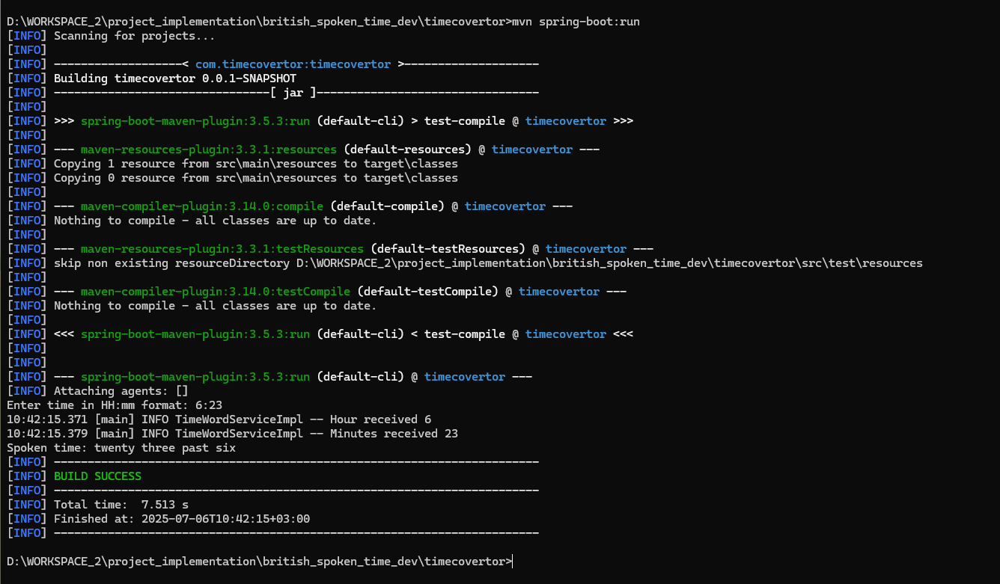

# 🕰 British Spoken Time Converter

This project converts 24-hour time (`"HH:mm"`) into spoken British English — for example, `"17:20"` becomes `"twenty past five"`.

---

## 🧰 Technologies Used

- Java 17 (JDK)
- Spring Boot 3.5.3
- Test-Driven Development (TDD)

---

## 🧪 Design Highlights

1. **Architecture**: Utilizes a clean, layered structure: `Controller → Service → Repository`.
2. **Development Approach**: Built using a TDD (Test-Driven Development) workflow — _Red → Green → Refactor_.
3. **Testing**: Includes comprehensive unit tests for both the Service and Repository layers.
4. **Input Handling**: Accepts input via the command line. (Easily extendable to a RESTful API.)
5. **Minimalist Design**: Excludes authentication and other complexities to maintain simplicity.

---

## 📐 Design Pattern

- **Strategy Pattern**: Employed to ensure the time conversion logic is modular and extensible. This also adheres to the **Single Responsibility** and **Open/Closed** principles.

---

## 🔧 Potential Enhancements

1. Implement a REST-based controller.
2. Add application-specific exceptions for better error clarity.
3. Integrate a global exception handler for unified error management.
4. Add controller-level and end-to-end (E2E) tests.
5. Containerize the application using Docker for cross-environment portability.

> **Note**: Due to time constraints, the above enhancements are not included but can be easily integrated.

---

## 🚀 Running the Application

```bash
# Build and run tests
mvn clean install

# Start the application
mvn spring-boot:run

```
